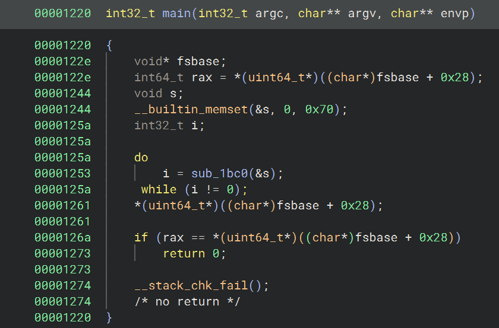
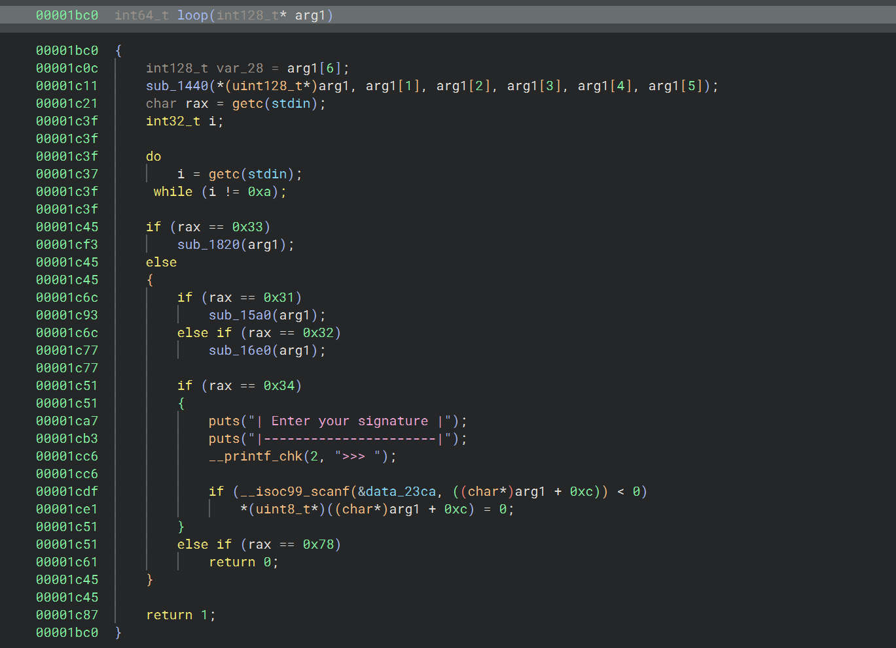
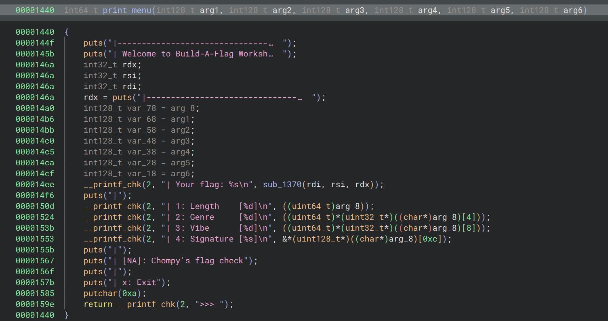
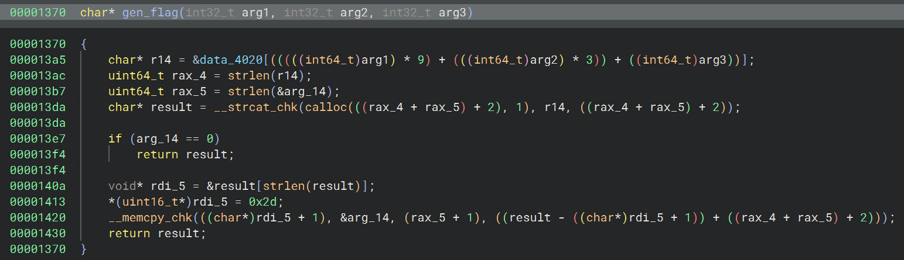
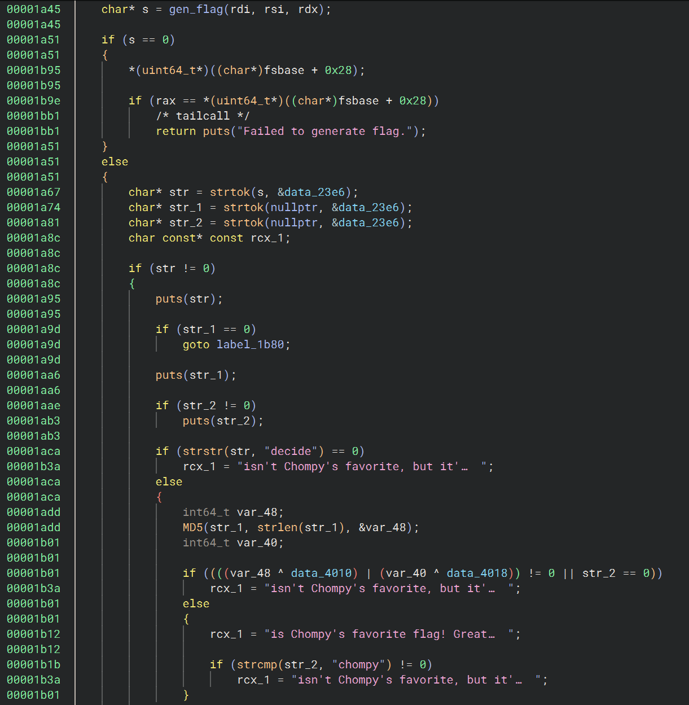
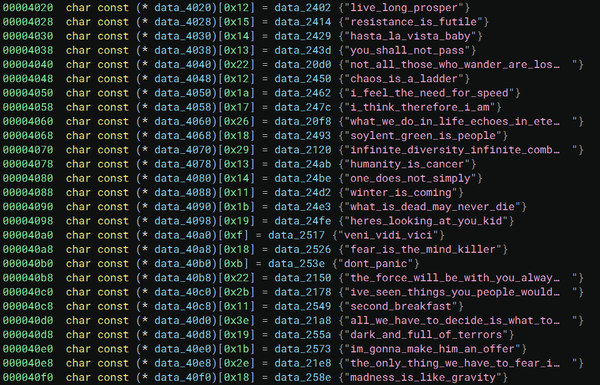
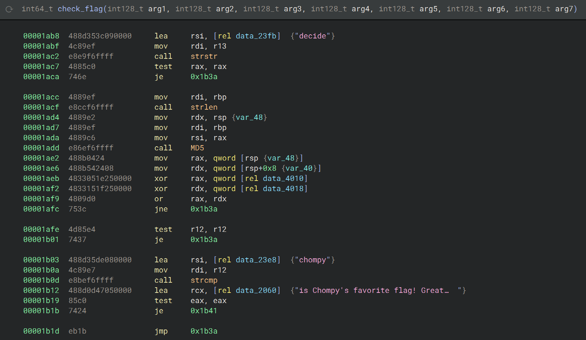
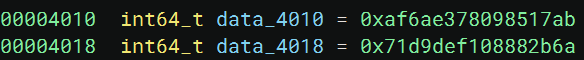
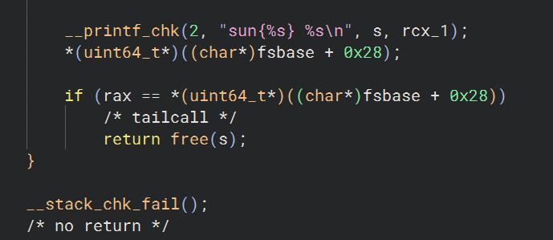

# Reversing/Build A Flag Workshop

Challenge Author: dpresso

## Prompt:

Don't you ever want to customize your very own flag? Well now you can with Chompy's brand new Build-A-Flag-Workshop (patent pending)!

[build-a-flag-workshop](build-a-flag-workshop) - Downloadable File

---

## Writeup

Downloading the file and examining the file type with `file build-a-flag-workshop` gives us
`build-a-flag-workshop: ELF 64-bit LSB pie executable, x86-64, version 1 (SYSV), dynamically linked, interpreter /lib64/ld-linux-x86-64.so.2, BuildID[sha1]=dcb939af00c61893197a7db006844d5aafa8499f, for GNU/Linux 3.2.0, stripped`

We have an ELF executable with 64 bit formatting.
Annoyingly, this file is stripped which makes me very sad. 
This means that none of the function names have been preserved through compiling, which makes debugging harder. 
Thankfully, you don't need to do all that much debugging for this challenge.

We can run the binary and see what happens.

| Welcome to Build-A-Flag Workshop! |
|-----------------------------------|
| Your flag: live_long_prosper      |
| 1: Length    [0]                  |
| 2: Genre     [0]                  |
| 3: Vibe      [0]                  |
| 4: Signature []                   |
| [NA]: Chompy's flag check         |
| x: Exit                           |

`>>>`

I swear I didn't write this table in, but the format of the output of the program is extremely close to that of markdown table syntax so I just fixed it up a little :3

Anyway, so it is asking for an input from 1-4. Let's say we input `3`.

If we do, it will ask us to modify the value of "vibe".

| Choose flag vibe |
|------------------|
| 1: Funny         |
| 2: Deep          |
| 3: Edgy          |
| x: Cancel        |

`>>>`

Let's say we input `2`.

| Welcome to Build-A-Flag Workshop! |
|-----------------------------------|
| Your flag: resistance_is_futile   |
| 1: Length    [0]                  |
| 2: Genre     [0]                  |
| 3: Vibe      [1]                  |
| 4: Signature []                   |
| [NA]: Chompy's flag check         |
| x: Exit                           |

Now we're back at this main menu thing, but our flag has been changed.
Clearly there's some sort of list of potential flags that it chooses from based on your input.
We can note that the internal values are indexed from 0, but the user inputs are indexed from 1. It's not too important.

I want to note two more things before we get heavy into the reversing section of this. 
Option 4: signature, allows you to add any string you specify to the end of this flag, this will be important later.
There's also a `Chompy's flag check` option, though it seems inaccessible, so we may want to keep an eye out for that function in the binary.

---
### Reversing

Here's where things get fun. Choose the decompiler of your choice and open this binary up. 
I chose Binary Ninja, but Ghidra works really well too.
We can see that we have a bunch of functions here. We're going to want to find our main function.
Remember when I said that stripped binaries are annoying? This is why. The main function isn't going to be named "main".
It's only going to have an address. 
Thankfully, we can just look in the `_start` function, and that has a call to a libc library that takes the address of main as the first argument, so we can use that to find main.
In Binary Ninja, this is labeled main by default. Let's take a look at the main function:

There's some sort of do while loop going on, and based on the behavior, we can probably say that that is main menu loop
We're going to label that function as `loop` and then take a look at its functionality:

This one is a bit more involved. It first calls a function with some amount of arguments. 
Binary Ninja didn't do the best job with this, but those arguments are the values of the 3 inputs that we can change in the binary. 
It makes more sense when you look at the function itself:

This is clearly printing the entire menu and everything involved with that. 
We can see that the args are being used to fill the format strings in the menu.
There's also another interesting function call whose result is being used to fill the flag string. 
We will look at that one too:

To be honest, Binary Ninja did not do good with this function, but the best way to examine this is with the context we gathered when just running the binary.
This has to generate the binary, so first it needs to get the flag that corresponds to the indices we specify.
That is done in the first line, and those values are stored at data_4020, which we will look at in a bit.
Now in the source code, this is probably using some sort of multidimensional list, but the compiler turns it into the mess that is on that line, but it doesn't really matter.
The rest of this code is adding on the signature. I'm not going into depth on that, but basically it adds a hyphen to the string, then adds the signature.
arg_14 is that pointer to the signature to be clear.

Regardless, we have a pretty good idea what's going on, but we have one more thing unaccounted for: Chompy's flag check
If we take a look through all the functions, we can find one that looks like a checker.
This doesn't take that long; there aren't that many functions defined in this executable:

This isn't the entire function, but it is enough for us to understand what needs to happen.
When we look at where this function is referenced, it is never called. This is the check function.
We can see that the function stores different strings to rcx_1 depending on the flow of the program.
One of these strings says `is Chompy's favorite flag! Great work.`
It's not a stretch to say we need the control flow of this function to assign that string to the variable.
Let's figure out how.

We can see that it stores the generated flag in s, then it creates 3 substrings using strtok.
For those unfamiliar with C functions, strtok is a string splitter; it splits strings at certain characters and returns the next part of the substring on each subsequent call.
We can see that it is using a string called data_23e6.
I'm not going to take a whole screenshot to tell you what that is. Double-clicking on it, we can see it is the hyphen character.
This means that the correct flag should have 3 substrings separated by hyphens.
Next, the first substring is used in a call to strstr. This C function finds the second string in the first string.
It will return the index of the first occurrence of the substring. In this case, the substring is "decide". 
Since we know the first part of the flag is the quotes, we know that the quote must have the word "decide" in it. 
Otherwise, the strstr functions returns 0, which is the index not found returned, which takes us to the wrong section of the program.
Now, I believe it's time to take a look at the possible strings that could be generated via gen_flag.
We're going pull up that array of the strings:

We can see that, even though these strings are cut off, only one of them has "decide" in it.
That is the famous lord of the rings quote: "All we have to decide is what to do with the time given to us." (Separated by underscores in this example)
We have found the first part of the flag.

Next is the hard part.
I believe it's beneficial to look at the next section of the program in assembly, so here we go:

So what in the hell is happening here?
You may recognize MD5. I sure did, it dawned on me what was happening pretty fast.
The program takes the second substring, MD5 hashes it, and then compares each half to an integer.
You may not see this comparison directly, but the XOR operations are the important part. 
When the binary representation of a value is the same as another and an XOR is done, the result is 0.
That is what this section of assembly is using.
You may ask why it's doing this in 2 steps. Remember that we are working in a 64 bit program. 
The output of an MD5 hash is a 128 bit output. That's why this must be done in 2 parts.
The 2 outputs of the XORs are combined using bitwise OR and if that result is not 0, we jump to the wrong section of the program.
Basically in short, the second substring is hashed and the resulting hash is compared to a stored hash. 
If it matches, then that's the next part of the flag. Let's go see what the hash is compared to:

I've made these integers display as unsigned hex values, so surely the hash should just be those 2 integers concatenated right?
No. Introducing: The concept of Endianness:
When working with binaries, the way that bytes are ordered in a certain architecture isn't always constant.
Sometimes, the most significant byte is stored first, and sometimes it's the other way.
In this context, we are working in Little Endian. This is specified in the ELF header.
Since we are working in 64bit, this means the LEAST significant byte in a set of 8 bytes is always stored first.
This effectively means that if you try to convert these integers to hex values, the one's place is at the START.
To convert this, we need to take every set of 2 hex values (which represents 1 byte) and reverse them.
I forgot to do this initially, and it added hours onto my solve time.
I only remembered this when I was frustratingly debugging the binary with GDB and I searched for the values representing the hash, hexdumped them, and got a completely different hash than what I had been trying. 
I solved this pretty quickly after that.
Reversing the order of the bytes gives us this hash:
`ab17850978e36aaf6a2b8808f1ded971`

There's 2 ways to go about cracking this hash. Some online databases have already cracked it, so you can enter into there. 
An example is a site like [crackstation.net](https://crackstation.net/), which cracks this hash instantly
The way I did it (which is objectively harder), is to generate some wordlists and crack the hash like that.
I will talk through the wordlist cracking way because I get to talk a bit about password cracking in this reversing challenge which is cool.
I knew that the quote was from Lord of the Rings, so I generated a wordlist using the wikipedia page for Lord of the Rings.
I did this using [Cewl](https://www.kali.org/tools/cewl/). It takes a webpage, scrapes all the words, then creates a wordlist from them.
I used -d 0 to make sure it didn't click into any of the webpages linked on wikipedia, which would've taken forever.
Then I ran it with hashcat using OneRuleToEndAllRules (which was definitely overkill, I probably could've used Best64 and it would've been fine). 
Here are the commands.

`cewl -w wordlist.txt -d 0 https://en.wikipedia.org/wiki/The_Lord_of_the_Rings`
`hashcat -m 0 ab17850978e36aaf6a2b8808f1ded971 wordlist.txt -r /usr/share/hashcat/rules/OneRuleToEndAllRules.rule`

This gave back that the hash was `gandalf` which makes sense; he was the one who said the quote after all.
You could've probably just skipped a lot of this hash stuff if you guessed that, which would've worked too.
I just wanted an excuse to talk about password cracking.

The last part of the flag is easy. The third substring is used for a strcmp function call. 
It is compared directly to the string "chompy". 
We know that we have to get 0 from this result, which is the result you get when both of the strings match perfectly. 
Now we can deduce that the last part of the string is chompy. With all of this information, we can finally put together the flag.
Just to confirm, I'm going to show what the rest of the function does.

It prints out the flag string in the format `sun{%s}`, then the result string.
So we assemble the flag using all of this information and putting hyphens between each of the substrings we worked out.
This gives us the flag:

`sun{all_we_have_to_decide_is_what_to_do_with_the_time_given_to_us-gandalf-chompy}`

### My thoughts:
- Difficulty: 5/10
- Enjoyability: 6/10

This reversing challenge wasn't that bad, but it is probably the hardest one I've solved so far.
I definitely would've enjoyed it more if I had figured out my hash problem sooner, but whatever, it was still neat.

